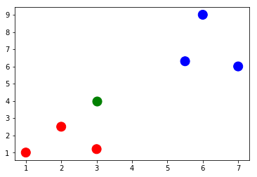
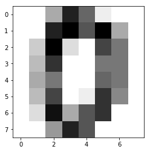
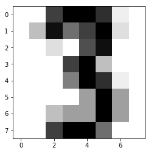
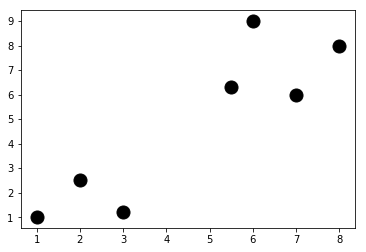
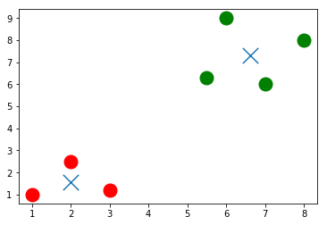
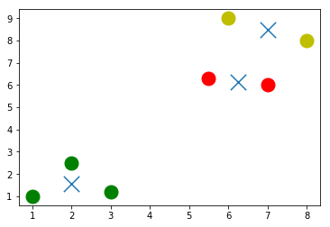
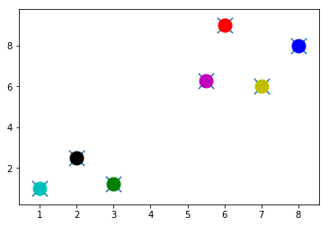

# jupyterAndCS50

```python
%lsmagic
```


    Available line magics:
    %alias  %alias_magic  %autocall  %automagic  %autosave  %bookmark  %cd  %clear  %cls  %colors  %config  %connect_info  %copy  %ddir  %debug  %dhist  %dirs  %doctest_mode  %echo  %ed  %edit  %env  %gui  %hist  %history  %killbgscripts  %ldir  %less  %load  %load_ext  %loadpy  %logoff  %logon  %logstart  %logstate  %logstop  %ls  %lsmagic  %macro  %magic  %matplotlib  %mkdir  %more  %notebook  %page  %pastebin  %pdb  %pdef  %pdoc  %pfile  %pinfo  %pinfo2  %popd  %pprint  %precision  %profile  %prun  %psearch  %psource  %pushd  %pwd  %pycat  %pylab  %qtconsole  %quickref  %recall  %rehashx  %reload_ext  %ren  %rep  %rerun  %reset  %reset_selective  %rmdir  %run  %save  %sc  %set_env  %store  %sx  %system  %tb  %time  %timeit  %unalias  %unload_ext  %who  %who_ls  %whos  %xdel  %xmode
    
    Available cell magics:
    %%!  %%HTML  %%SVG  %%bash  %%capture  %%cmd  %%debug  %%file  %%html  %%javascript  %%js  %%latex  %%perl  %%prun  %%pypy  %%python  %%python2  %%python3  %%ruby  %%script  %%sh  %%svg  %%sx  %%system  %%time  %%timeit  %%writefile
    
    Automagic is ON, % prefix IS NOT needed for line magics.


```python
import numpy as np
import matplotlib.pyplot as plt
%matplotlib inline
```


```python
x_train = np.array([[1,1],[2,2.5],[3,1.2],[5.5,6.3],[6,9],[7,6]])
y_train = ['red','red','red','blue','blue','blue']

```


```python
print(x_train[5,0])
print(x_train[5,1])
print(x_train[:,0])
print(x_train[:,1])
```

    7.0
    6.0
    [ 1.   2.   3.   5.5  6.   7. ]
    [ 1.   2.5  1.2  6.3  9.   6. ]
    


```python
x_test = np.array([3,4])
```


```python
plt.figure()
plt.scatter(x_train[:,0],x_train[:,1],s=170,color=y_train[:])
plt.scatter(x_test[0],x_test[1],s=170,color='green')
plt.show()
```





```python
def dist(x,y):
    return np.sqrt(np.sum((x-y)**2))
```


```python
num = len(x_train)
distance = np.zeros(num)
for i in range(num):
    distance[i] = dist(x_train[i],x_test)
print(distance)
```

    [ 3.60555128  1.80277564  2.8         3.39705755  5.83095189  4.47213595]
    


```python
min_index = np.argmin(distance)
print(y_train[min_index])
```

    red
    


```python
from sklearn import datasets
```


```python
digits = datasets.load_digits()
print(digits.images[0])
```

    [[  0.   0.   5.  13.   9.   1.   0.   0.]
     [  0.   0.  13.  15.  10.  15.   5.   0.]
     [  0.   3.  15.   2.   0.  11.   8.   0.]
     [  0.   4.  12.   0.   0.   8.   8.   0.]
     [  0.   5.   8.   0.   0.   9.   8.   0.]
     [  0.   4.  11.   0.   1.  12.   7.   0.]
     [  0.   2.  14.   5.  10.  12.   0.   0.]
     [  0.   0.   6.  13.  10.   0.   0.   0.]]
    


```python
plt.figure()
plt.imshow(digits.images[0],cmap = plt.cm.gray_r, interpolation = 'nearest')
plt.show()
```





```python
print(digits.target[0])
```

    0
    


```python
x_train = digits.data[0:10]
y_train = digits.target[0:10]
```


```python
x_test = digits.data[345]
```


```python
plt.figure()
plt.imshow(digits.images[345], cmap = plt.cm.gray_r, interpolation ='nearest')
plt.show()
```





```python
num = len(x_train)
distance = np.zeros(num)
for i in range(num):
    distance[i] = dist(x_train[i],x_test)
min_index = np.argmin(distance)
print(y_train[min_index])
```

    3
    


```python
num = len(x_train)
distance = np.zeros(num)
for i in range(num):
    distance[i] = dist(x_train[i],x_test)
min_index = np.argmin(distance)
print(y_train[min_index])
```

    3
    


```python
num  = len(x_train)
no_errors = 0
distance = np.zeros(num)
for j in range(1697,1797):
    x_test = digits.data[j]
    for i in range(num):
        distance[i] = dist(x_train[i],x_test)
    min_index = np.argmin(distance)
    if y_train[min_index] != digits.target[j]:
        no_errors += 1
print(no_errors)
```

    37
    


```python
x_train = digits.data[0:1000]
y_train = digits.target[0:1000]
num  = len(x_train)
no_errors = 0
distance = np.zeros(num)
for j in range(1697,1797):
    x_test = digits.data[j]
    for i in range(num):
        distance[i] = dist(x_train[i],x_test)
    min_index = np.argmin(distance)
    if y_train[min_index] != digits.target[j]:
        no_errors += 1
print(no_errors)
```

    3
    


```python
X = np.array([[1,1],[2,2.5],[3,1.2],[5.5,6.3],[6,9],[7,6],[8,8]])
```


```python
plt.figure()
plt.scatter(X[:,0],X[:,1],s=170,color='black')
plt.show()
```





```python
from sklearn.cluster import KMeans
```


```python
k=2
kmeans = KMeans(n_clusters = k)
kmeans.fit(X);
centroids = kmeans.cluster_centers_
labels = kmeans.labels_
```


```python
colors = ['r.','g.']
plt.figure()
for i in range(len(X)):
    plt.plot(X[i,0], X[i,1], colors[labels[i]],markersize = 30)
plt.scatter(centroids[:,0],centroids[:,1],marker="x",s=300,linewidths=5)
plt.show()
```





```python
k=3
kmeans = KMeans(n_clusters = k)
kmeans.fit(X);
centroids = kmeans.cluster_centers_
labels = kmeans.labels_
colors = ['r.','g.','y.']
plt.figure()
for i in range(len(X)):
    plt.plot(X[i,0], X[i,1], colors[labels[i]],markersize = 30)
plt.scatter(centroids[:,0],centroids[:,1],marker="x",s=300,linewidths=5)
plt.show()
```





```python
k=7
kmeans = KMeans(n_clusters = k)
kmeans.fit(X);
centroids = kmeans.cluster_centers_
labels = kmeans.labels_
colors = ['r.','g.','y.','c.','b.','k.','m.']
plt.figure()
for i in range(len(X)):
    plt.plot(X[i,0], X[i,1], colors[labels[i]],markersize = 30)
plt.scatter(centroids[:,0],centroids[:,1],marker="x",s=300,linewidths=5)
plt.show()
```





```python
corpus = ['I love CS50. Staff is awesome, awesome, awesome!',
          'I have a dog and a cat.',
          'Best of CS50? Staff. And cakes. Ok, CS50 staff.',
          'My dog keeps chasing my cat. Dogs!']
```


```python
from sklearn.feature_extraction.text import CountVectorizer
count_vect = CountVectorizer(stop_words = 'english')
z = count_vect.fit_transform(corpus)
z.todense()
```


    matrix([[3, 0, 0, 0, 0, 1, 0, 0, 0, 1, 0, 1],
            [0, 0, 0, 1, 0, 0, 1, 0, 0, 0, 0, 0],
            [0, 1, 1, 0, 0, 2, 0, 0, 0, 0, 1, 2],
            [0, 0, 0, 1, 1, 0, 1, 1, 1, 0, 0, 0]], dtype=int64)


```python
vocab = count_vect.get_feature_names()
print(vocab)
```

    ['awesome', 'best', 'cakes', 'cat', 'chasing', 'cs50', 'dog', 'dogs', 'keeps', 'love', 'ok', 'staff']
    


```python
from sklearn.feature_extraction.text import TfidfVectorizer
vectorizer = TfidfVectorizer(stop_words = 'english')
X = vectorizer.fit_transform(corpus)
X.todense()
```


    matrix([[ 0.89469821,  0.        ,  0.        ,  0.        ,  0.        ,
              0.23513012,  0.        ,  0.        ,  0.        ,  0.29823274,
              0.        ,  0.23513012],
            [ 0.        ,  0.        ,  0.        ,  0.70710678,  0.        ,
              0.        ,  0.70710678,  0.        ,  0.        ,  0.        ,
              0.        ,  0.        ],
            [ 0.        ,  0.35415727,  0.35415727,  0.        ,  0.        ,
              0.55844332,  0.        ,  0.        ,  0.        ,  0.        ,
              0.35415727,  0.55844332],
            [ 0.        ,  0.        ,  0.        ,  0.38274272,  0.48546061,
              0.        ,  0.38274272,  0.48546061,  0.48546061,  0.        ,
              0.        ,  0.        ]])


```python
k=2
from sklearn.metrics.pairwise import cosine_similarity
dist = 1 - cosine_similarity(X)
model = KMeans(n_clusters=k)
model.fit(X)
```


    KMeans(algorithm='auto', copy_x=True, init='k-means++', max_iter=300,
        n_clusters=2, n_init=10, n_jobs=1, precompute_distances='auto',
        random_state=None, tol=0.0001, verbose=0)


```python
print("Top terms per cluster:\n")
order_centroids = model.cluster_centers_.argsort()[:,::-1]
terms = vectorizer.get_feature_names()
for i in range(k):
    print("Cluster %i:" % i, end='')
    for ind in order_centroids[i,:3]:
        print(' %s,' % terms[ind], end='')
    print("")
```

    Top terms per cluster:
    
    Cluster 0: awesome, staff, cs50,
    Cluster 1: dog, cat, keeps,
    


```python
import pandas as pd
from io import StringIO
import requests

act = requests.get('https://docs.google.com/spreadsheets/d/1udJ4nd9EKlX_awB90JCbKaStuYh6aVjh1X6j8iBUXIU/export?format=csv')
dataact = act.content.decode('utf-8')
frame = pd.read_csv(StringIO(dataact))
print(frame)
```

                         Title                                           Synopsis
    0       Mad Max: Fury Road  Max Rockatansky (Tom Hardy) explains in a voic...
    1               The Matrix  The screen is filled with green, cascading cod...
    2        The King's Speech  The film opens with Prince Albert, Duke of Yor...
    3   No Country for Old Men  The film opens with a shot of desolate, wide-o...
    4         A Beautiful Mind  John Nash (Russell Crowe) arrives at Princeton...
    5                Inception  A young man, exhausted and delirious, washes u...
    6                   Frozen  The Walt Disney Pictures logo and the movie ti...
    7            The Lion King  The Lion King takes place in the Pride Lands o...
    8                  Aladdin  The film starts with a street peddler, guiding...
    9               Cinderella  The film opens in a tiny kingdom, and shows us...
    10            Finding Nemo  Two clownfish, Marlin (Albert Brooks) and his ...
    11               Toy Story  A boy called Andy Davis (voice: John Morris) u...
    12              Robin Hood  Told with animals for it's cast, the story tel...
    


```python
corpus = []
for i in range(0, frame["Synopsis"].size):
    corpus.append(frame["Synopsis"][i])
```


```python
from sklearn.feature_extraction.text import TfidfVectorizer
vectorizer = TfidfVectorizer(stop_words = 'english', min_df = 0.2)
X = vectorizer.fit_transform(corpus)
```


```python
k = 2 
from sklearn.metrics.pairwise import cosine_similarity
dist = 1 - cosine_similarity(X)
model = KMeans(n_clusters = k)
model.fit(X);
```


```python
no_words = 4 
order_centroids = model.cluster_centers_.argsort()[:, ::-1] 
terms = vectorizer.get_feature_names()
labels = model.labels_ 

print("Top terms per cluster:\n")
for i in range(k):
    
    print("Cluster %d movies:" % i, end='')
    for title in frame["Title"][labels == i]:
        print(' %s,' % title, end='')
    print() #add a whitespace

    print("Cluster %d words:" % i, end='') 
    for ind in order_centroids[i, :no_words]:
        print (' %s' % terms[ind], end=','),
    print()
    print()
```

    Top terms per cluster:
    
    Cluster 0 movies: Mad Max: Fury Road, The Matrix, No Country for Old Men, A Beautiful Mind, Inception, The Lion King, Finding Nemo, Toy Story,
    Cluster 0 words: says, tank, room, joe,
    
    Cluster 1 movies: The King's Speech, Frozen, Aladdin, Cinderella, Robin Hood,
    Cluster 1 words: king, prince, duke, palace,
    
    
